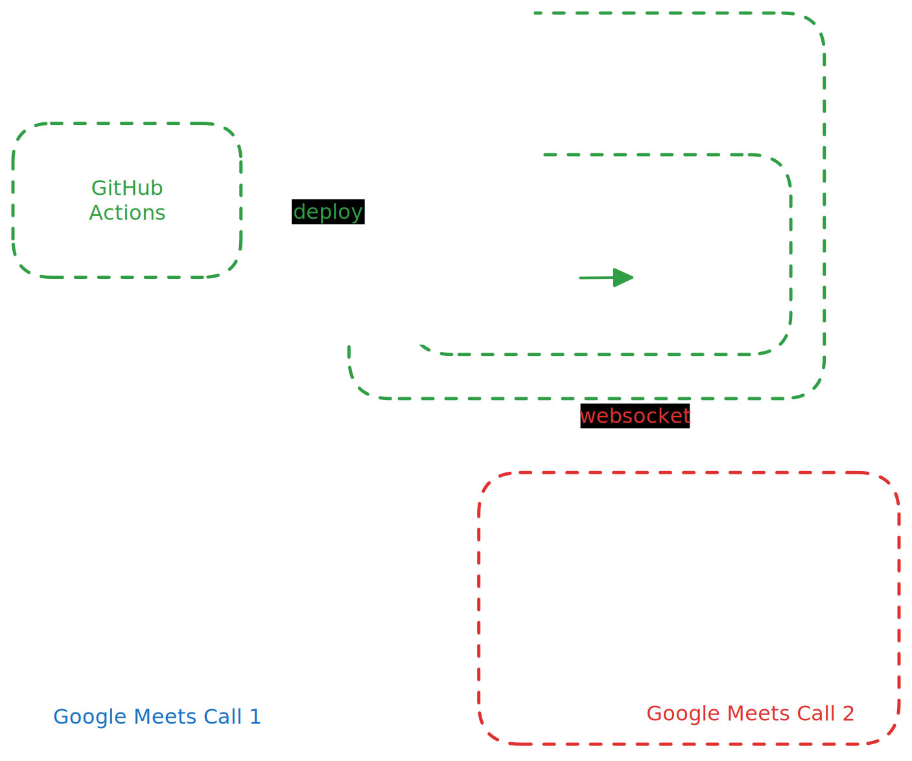

    

# Google Meets Utils Chrome Extension

## Overview

The Google Meet Utils Chrome Extension is designed to enhance the user experience during Google Meet sessions by providing utilities that automate certain actions, such as leaving a call.

The main feature is anonymous call ending: when all users on a call have pressed an "End Call" button, the call will be ended automatically. If you've ever been sat in a call with someone wanting to leave but didn't want to be rude, this is the feature for you.

## Components

### 1. Chrome Extension (`@plugin`)

The Chrome extension is the client-side component that interacts with Google Meet. It consists of the following key files:

- **`manifest.json`**: Defines the extension's metadata, permissions, and background scripts.
- **`src/content.ts`**: Contains the main logic for the extension, including socket connection to the backend and DOM manipulation to add custom buttons in the Google Meet interface.
- **`dist/`**: Contains the compiled JavaScript files that are loaded by the Chrome extension.

### 2. Backend Service (`@backend`)

The backend service is responsible for handling real-time events and managing the state of the application. It is built using NestJS and Socket.IO. Key components include:

- **WebSocket Gateway**: Manages WebSocket connections and handles events such as client connections and disconnections.
- **Event Handlers**: Services that respond to specific events, such as `EndCallService`, which handles the logic for ending a call.
- **Modules**: Organizes the application into cohesive units, such as the `EventsModule`, which encapsulates all event-related functionality.

### 3. Provisioning Infrastructure (`@provisioning`)

The provisioning infrastructure is responsible for deploying the backend service to AWS using the AWS CDK. Key components include:

- An EC2 instance running the backend service.
  - A Redis instance for storing the state of the call - as this is currently running via docker inside a single EC2 instance, if the application needs to scale, we'll need to move this to a managed Redis instance.
- A VPC with a public subnet and a private subnet.

### 4. CI/CD Workflows (`@.github`)

The CI/CD workflows automate the deployment process for both the backend and the provisioning infrastructure. Key workflows include:

- **Deploy Backend**: Triggers on changes to the backend or provisioning code, builds the Docker image, and deploys it to an EC2 instance.
- **Deploy Infrastructure**: Triggers on changes to the provisioning code, installs dependencies, and deploys the CDK stack to AWS.

## How It All Fits Together

1. The user installs the Chrome extension, which interacts with the Google Meet interface.
2. The extension establishes a WebSocket connection to the backend service, allowing for real-time event handling.
3. When a user clicks the button to end a call, the extension emits an event to the backend, which processes the request and communicates with other clients as needed.

## Getting Started

To get started with the Google Meet Utils Chrome Extension:

1. Clone the repository.
2. Navigate to the `plugin` directory and run `pnpm install` to install dependencies.
3. Build the extension using `pnpm run build`.
4. Load the unpacked extension in Chrome by navigating to `chrome://extensions` and selecting the `dist` directory.
5. Set up the backend by navigating to the `backend` directory and following the setup instructions.
6. Deploy the infrastructure using the AWS CDK commands in the `provisioning` directory.
